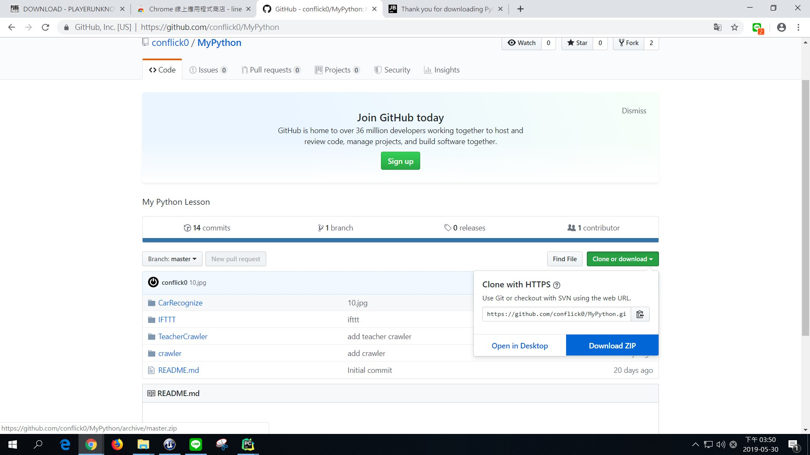
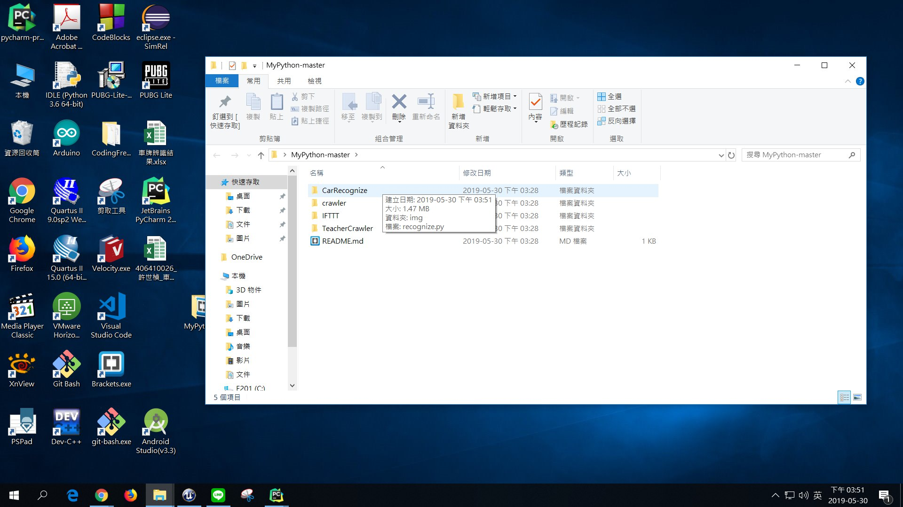
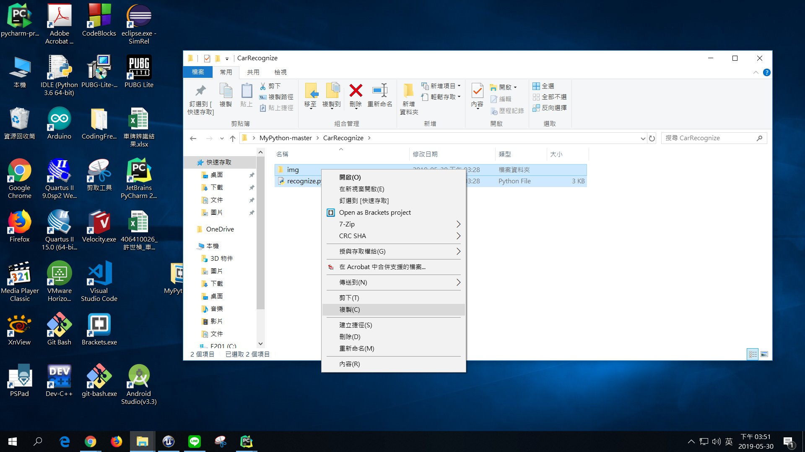
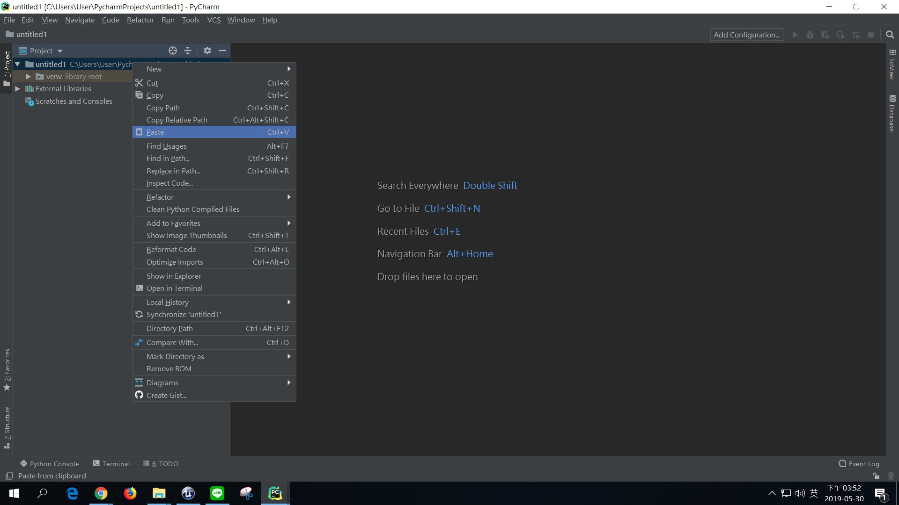
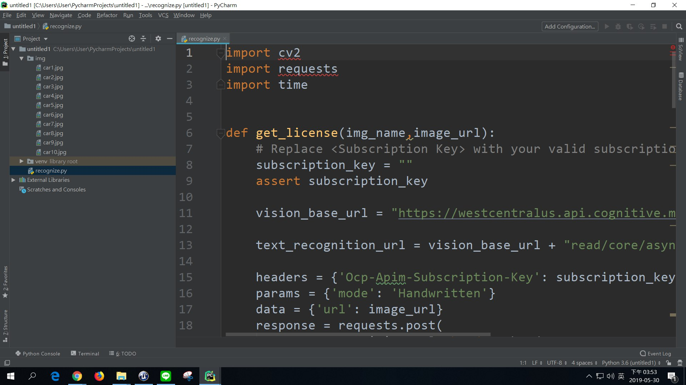
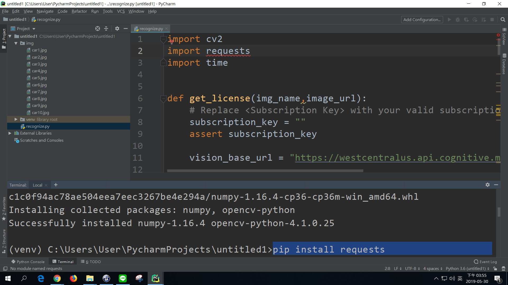
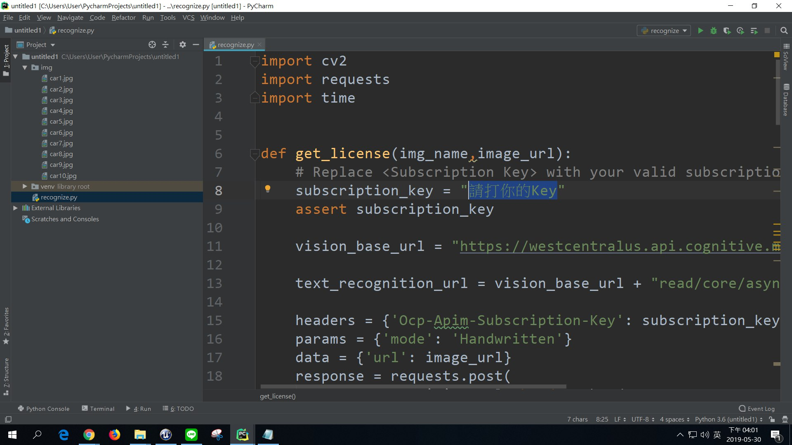
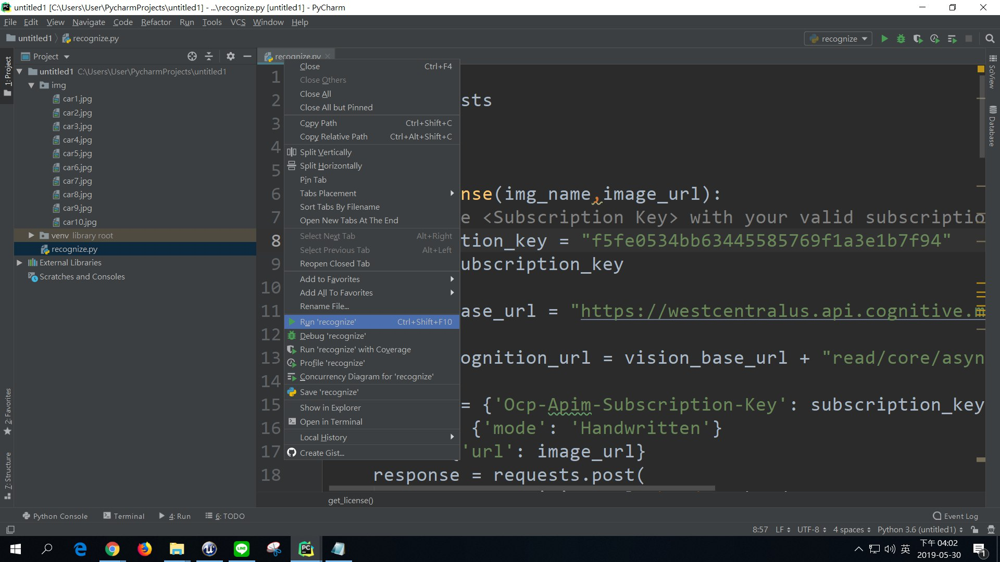
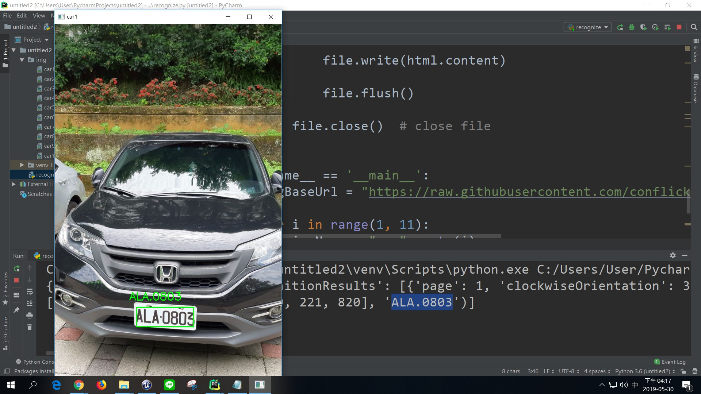
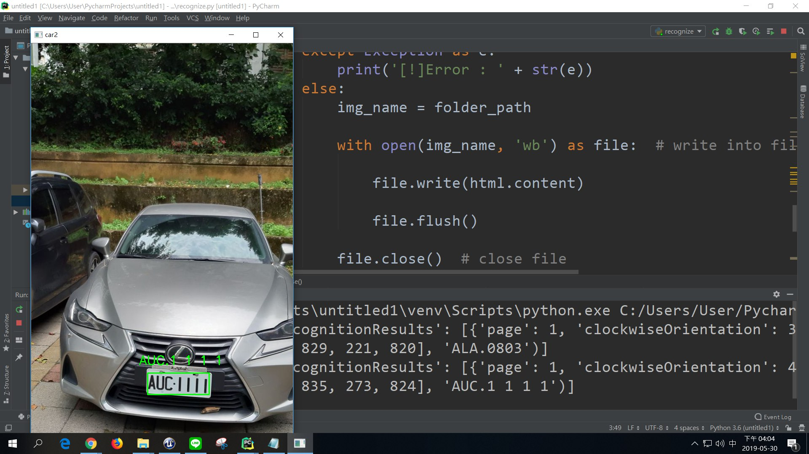

# MyPython
HW Car Recognize
--
# 1.Download zip
    

# 2.Click CarRecognize File
    

# 3.Copy all file
    

# 4.Past all file
    

# 5.Click recognize.py
    

# 6.pip install opencv_python
    

# 7.pip install requests
    

# 8.Please type your key
    

# 9.Run recognize.py
    

# 10.Press any key to show next img (or close window)
    

# 11.And so on...
    
